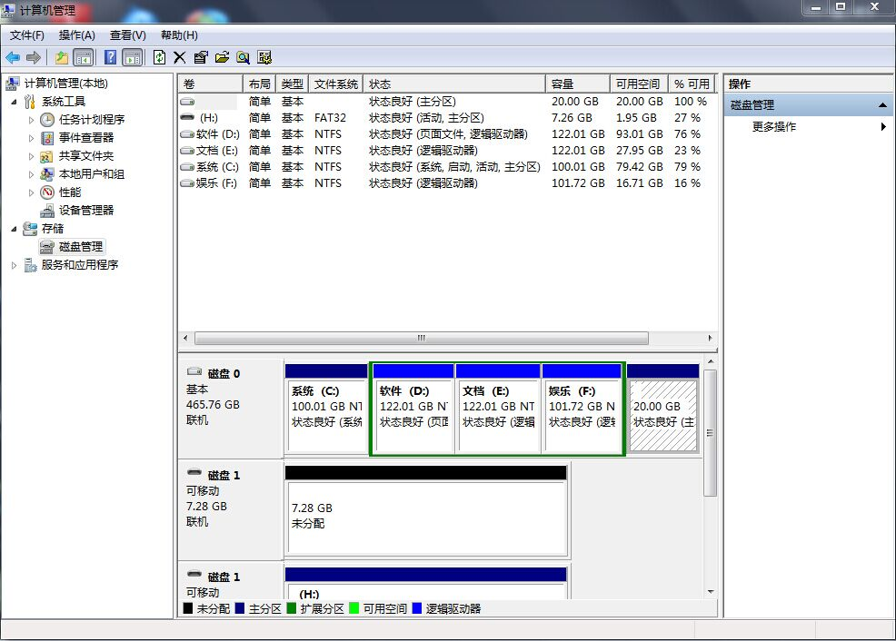
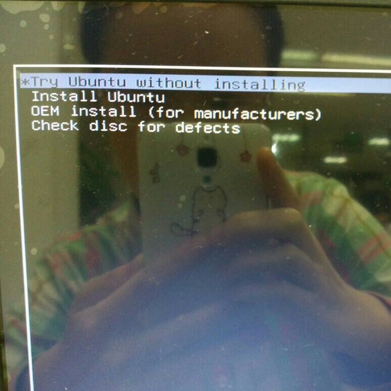
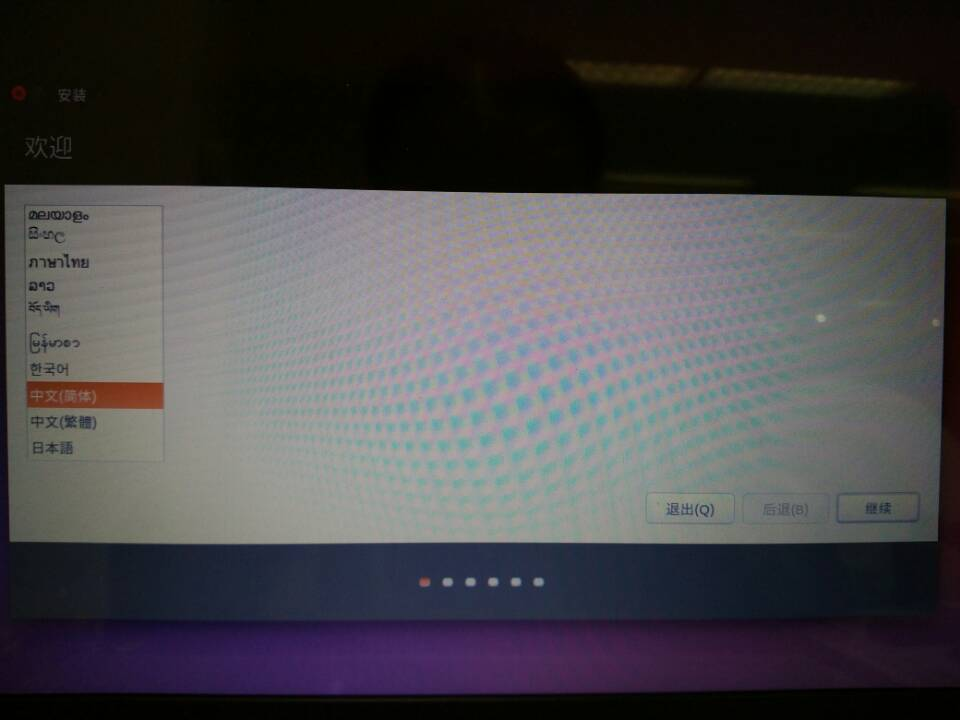
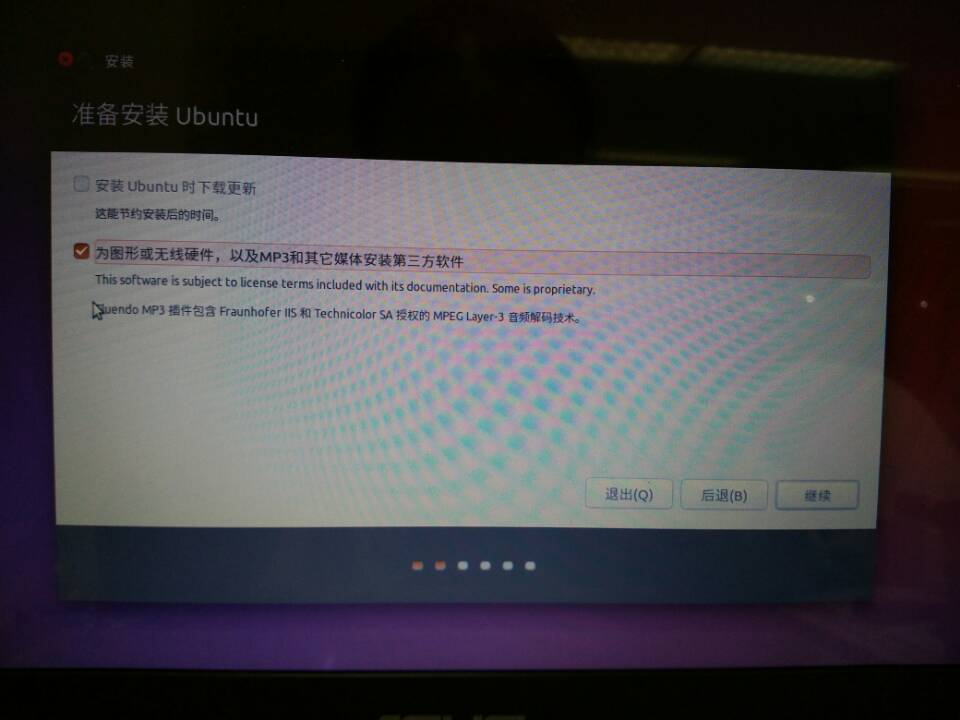
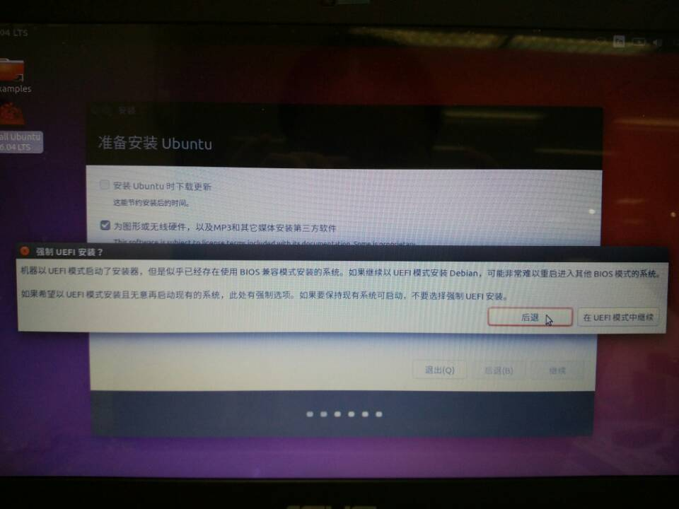
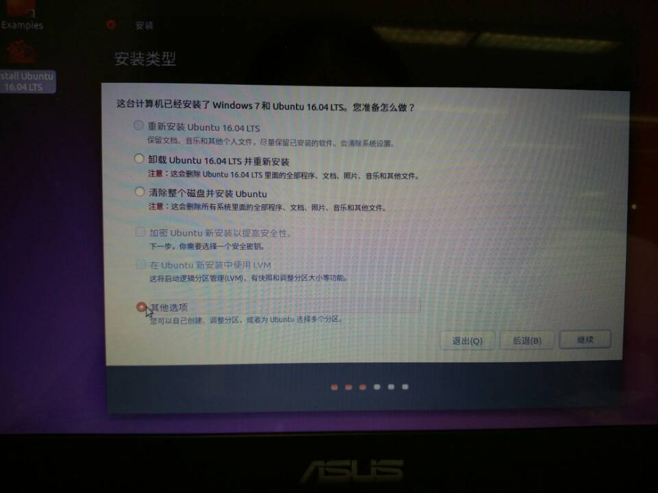
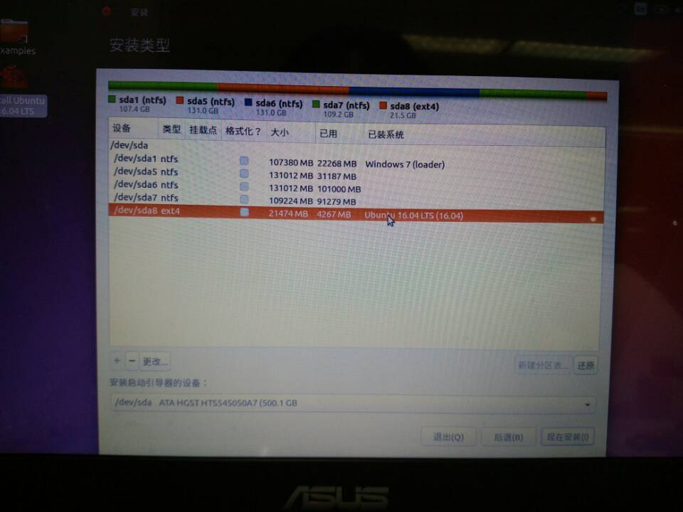
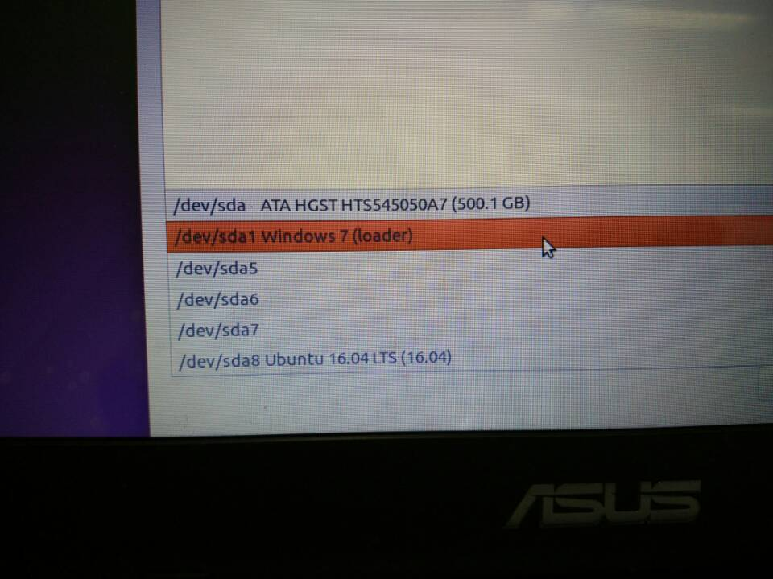
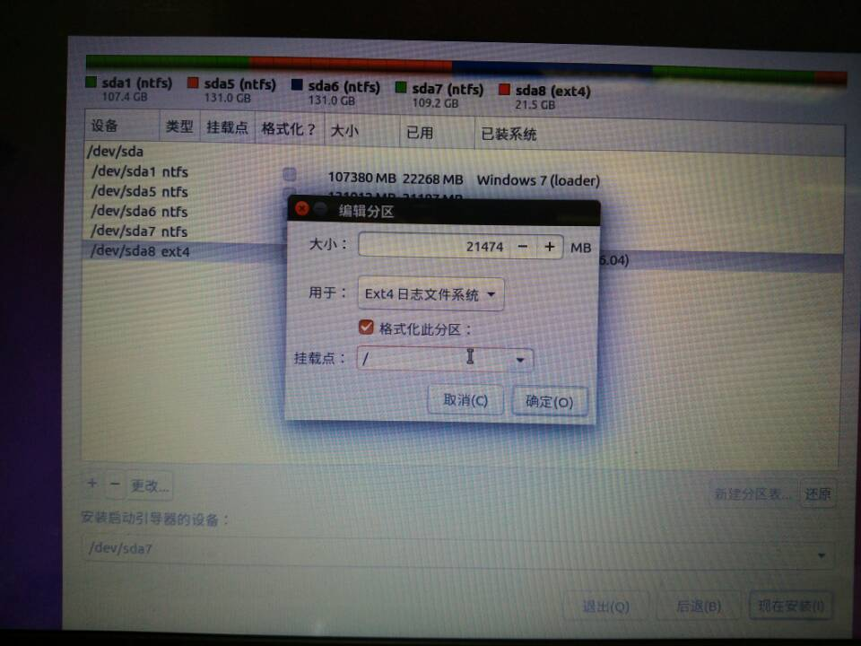

# 如何安装Windows7和Linux的双系统
我们安装的是ubuntu16.04这个操作系统。Ubuntu（乌班图）是一个以桌面应用为主的Linux操作系统，它是基于DebiaGNU/Linux，支持x86、amd64（即x64）和PPC架构，由全球化的专业开发团队（Canonical Ltd）打造的开源GNU/Linux操作系统。为桌面虚拟化提供支持平台。Ubuntu对GNU/Linux的普及特别是桌面普及作出了巨大贡献，由此使更多人共享开源的成果与精彩。
首先我们在网页上搜锁“Ubuntu”，点击进入其官网。点击立即下载。
然后进入这个界面，根据自己的笔记本电脑是32位机还是64位机选择合适的下载。例如我的笔记本电脑是64位的，就点击64位下载键。
然后等待下载。
接着再在网上下载并装一个这个软件，如右图所示。并准备一个空U盘，将其插在电脑上。
接着右键打开我的电脑，选择管理，点击磁盘管理，然后进行分区，分出20G来。记住不要分系统盘（C盘）。分好之后如下图所示。

然后打开deepin-boot-maker这个软件，选择U盘，和之前下载好的Ubuntu并点击格式化U盘，再点击开始并等待。
然后重启电脑（U盘不要拔出），注意笔记本电脑之前应该设置为U盘启动优先。这样你会看见如下的画面。
选择第一个选项Try ubuntu without installing。进入桌面后，点击ubuntu16.04安装这个图标。然后就开始安装啦！
接着点击中文（简体），点击继续。
接着选择第二个选项，点击继续。

接着点击后退（至于可不可以强制安装UEFI我也不知道，也没有尝试过），点击继续。
接着安装类型选择其他选项，点击继续。
接着出现这个画面，找到你分的那个盘，点击左下角的更改。

修改为如下图所示，点击确定。

安装启动装置不要选择windows loader即可。例如我选择sda7。

最后点击好之后出现如下这个画面。

最后点击现在安装，输入基本信息还有所在地点，等待安装即可。等全部安装完毕，点击重新启动。

